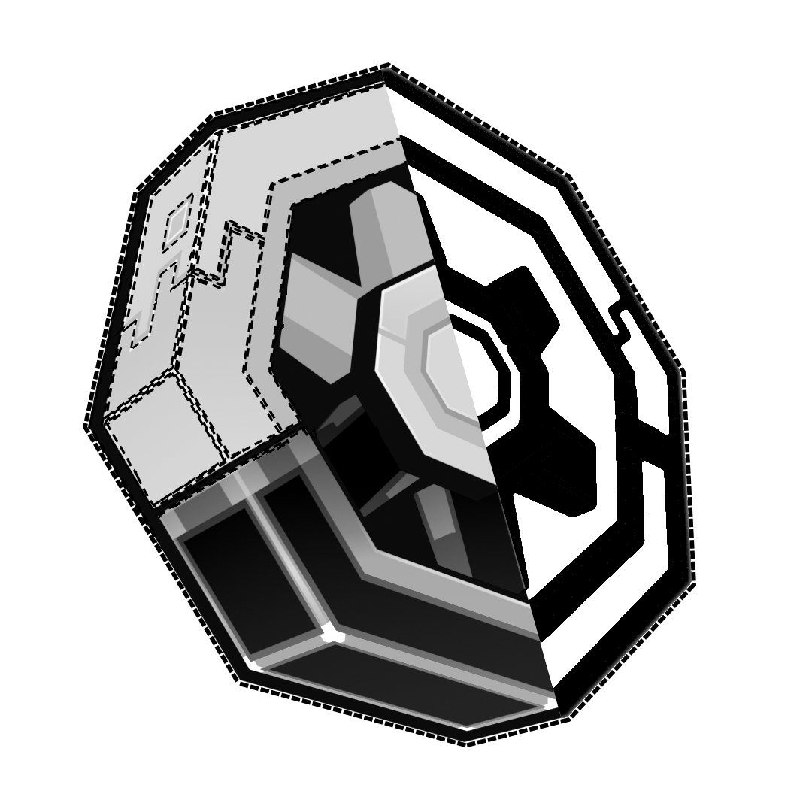

<h1>Nowheel</h1>

 

Nowheel makes Create machines not render when behind walls, **boosting performance**, especially in larger factories

### Without Nowheel

### With Nowheel

_The above images were taken on the "alpha industries" world with most of the factory occluded by a wall_

## This mod is built on and requires [Entity Culling](https://modrinth.com/mod/entityculling)
## [Create](https://modrinth.com/mod/create) is also required ~~(obviously)~~

### License

All code in this repository is licensed under the **MIT** license. You are free to read, distribute and modify the code.

### Credits

Belt and Chain conveyor AABBs are taken from [Create Smart Bounds](https://modrinth.com/mod/create-smart-bounds).