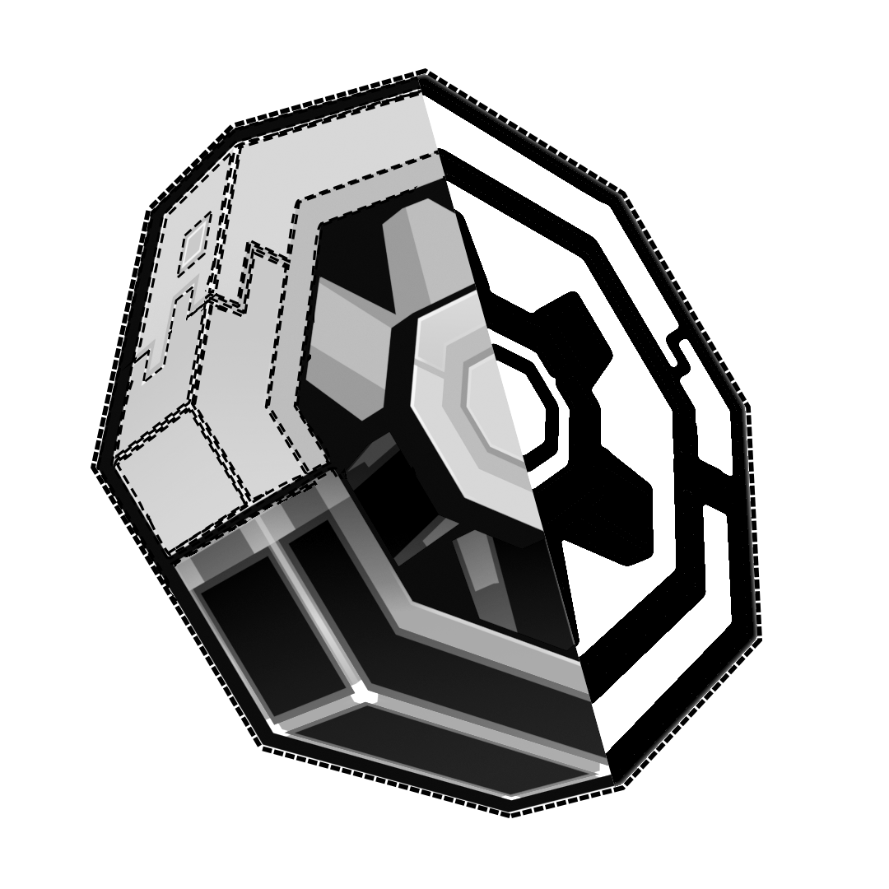

<h1>Nowheel</h1>

Nowheel is a simple and lightweight optimization mod for Create, unifying Flywheel and Entity Culling to improve frame rates, reduce micro-stutter, and fix bugs.

<b>New in 2.0: Pop-in and hitches should now be fully gone for most configurations!</b> 
<small>(Note: Indirect Flywheel is needed for this optimization. Colorwheel 1.3+ is needed if you are using shaders but other versions work)</small>

 

 

Nowheel increases performance by improving how Create handles machines that are not visible to the player. **This effect is greatly amplified in bigger factories where not many machines are actually visible.**

**Some of the optimizations that could impact visual fidelity or could have issues are disabled by default.**

Enabling these optimizations in the mod's config should generally be pretty harmless and provide a nice little performance improvement without sacrificing much. **Please report any issues that you experience with these options enabled.**
 
 

<ul>
  <li><small>World: Just Create SMP S1</small></li>
  <li><small>Flywheel backends are flywheel:indirect for no shaders and colorwheel:indirect for shaders (Colorwheel 1.3.0 beta3)</small></li>
  <li><small>Tick Culling and Distance Culling are enabled, render distance is at 16</small></li>
</ul>

### Nowheel fixes an Entity Culling + Sable bug where players sometimes visually disappear on simulated contraptions
 

## This mod is built on and requires [Entity Culling](https://modrinth.com/mod/entityculling)
## [Create](https://modrinth.com/mod/create) is also required ~~(obviously)~~
# [Colorwheel](https://modrinth.com/mod/colorwheel) is HIGHLY recommended if you use shaders

### License

All code in this repository is licensed under the **MIT** license. You are free to read, distribute and modify the code.

### Credits

Belt and Chain conveyor AABBs are taken from [Create Smart Bounds](https://modrinth.com/mod/create-smart-bounds).